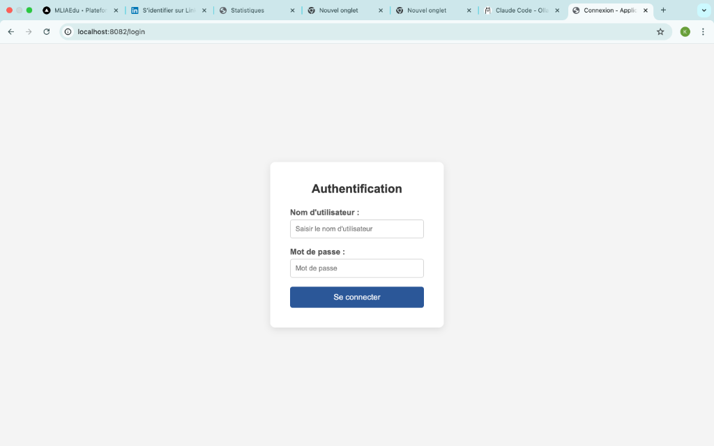
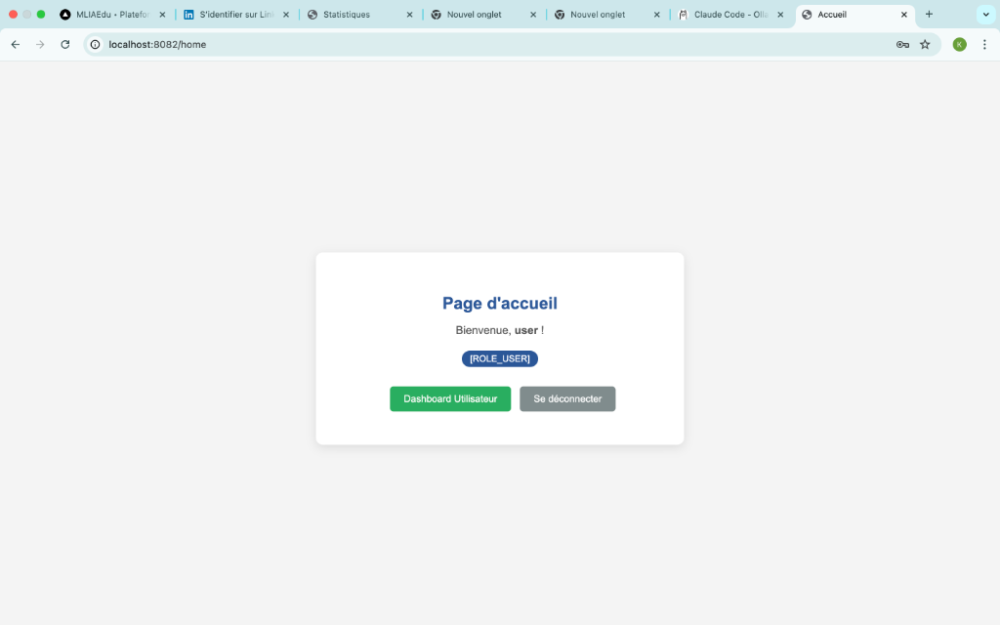
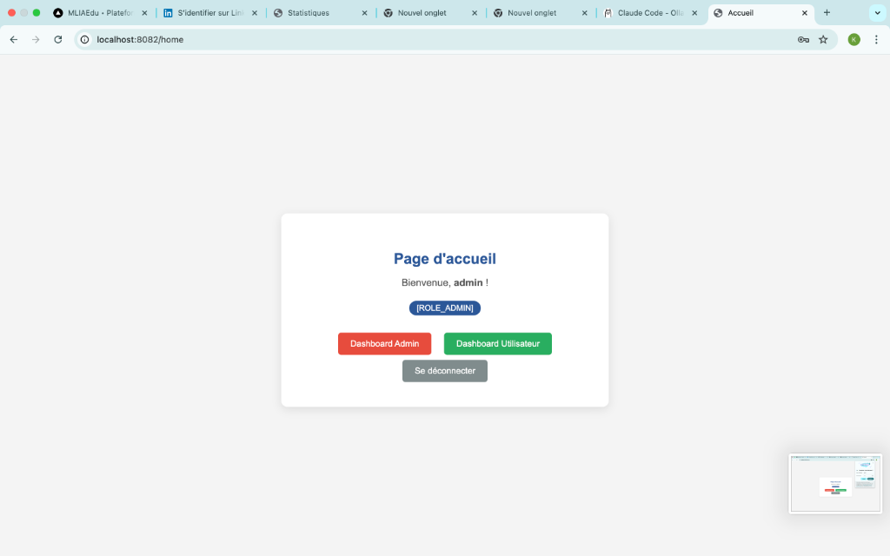

# Spring Security TP - Formulaire de Login Personnalisé

Ce projet est un exemple d'implémentation de **Spring Security** avec Spring Boot 3 et Thymeleaf. Il démontre comment configurer une page de connexion personnalisée, gérer des utilisateurs en mémoire et restreindre l'accès en fonction des rôles.

## Fonctionnalités

- Authentification In-Memory (Admin & User).
- Page de login personnalisée (`/login`).
- Contrôle d'accès basé sur les rôles (`ADMIN`, `USER`).
- Templates dynamiques avec Thymeleaf.
- Redirection après connexion réussie.

## Captures d'écran

### 1. Page d'Authentification


### 2. Page d'Accueil (Rôle USER)


### 3. Page d'Accueil (Rôle ADMIN)


## Installation et Lancement

### Prérequis
- Java 17 ou supérieur.
- Maven.

### Étapes
1. Clonez ou téléchargez le projet.
2. Ouvrez un terminal dans le dossier du projet.
3. Exécutez la commande suivante :
   ```bash
   mvn spring-boot:run
   ```
4. Accédez à l'application sur : [http://localhost:8082/login](http://localhost:8082/login)

## Utilisateurs de Test

| Identifiant | Mot de passe | Rôle |
| :--- | :--- | :--- |
| `admin` | `1234` | `ADMIN` |
| `user` | `1111` | `USER` |

## Structure du Projet

- `ma.fstg.security.config` : Configuration de la sécurité (`SecurityFilterChain`).
- `ma.fstg.security.web` : Contrôleur gérant les routes d'authentification.
- `src/main/resources/templates` : Pages HTML (Thymeleaf).
